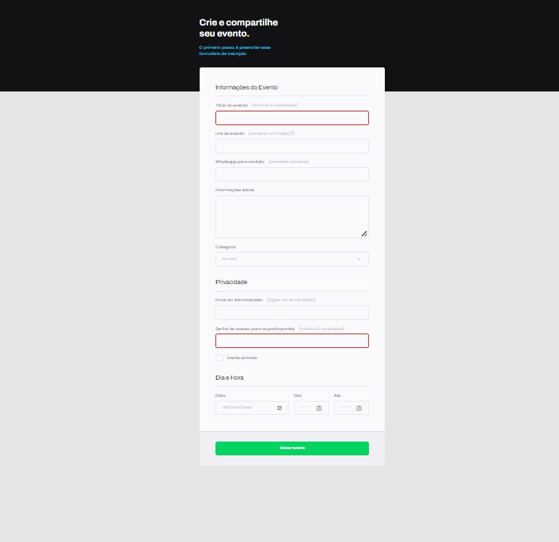

<h1 align="center"> Stage3 (Rocketseat): Eventos </h1>

  

  

  Atividade de aprendizagem em Explore, sendo fruto de um desafio promovido pela Rocketseat

 

## 🚀 Tecnologias

Esse projeto foi desenvolvido com as seguintes tecnologias:

- HTML e CSS
- Git e Github
- Figma

## 💻 Projeto

O desafio consiste em produzir uma pagina web de uma web venda de móveis do zero e após corrigir o mesmo projeto, porém com erros de  stilo CSS.

## 🔖 Layout

Você pode visualizar o layout do projeto através [DESSE LINK]([https://www.figma.com/community/file/1187422022288947321](https://www.figma.com/file/fAvYZz4dPV5MfhL77XkqkD/Explorer---Projeto-01/duplicate?type=design&node-id=0-1&mode=design)). É necessário ter conta no [Figma](https://figma.com) para acessá-lo.

## :memo: Licença

Esse projeto está sob a licença MIT.

---

Feito com ♥ by Rocketseat :wave: [Participe da nossa comunidade!](https://discord.gg/rocketseat)
